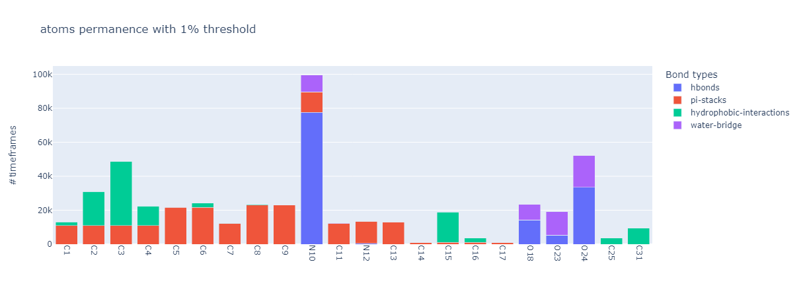
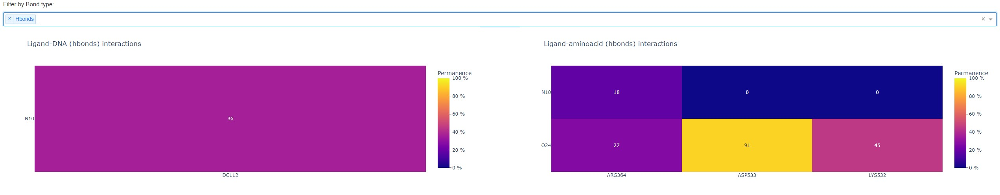

# MD-ligand-receptor

MD-ligand-receptor is a bioinformatics pipeline written in Python for analyzing non-covalent ligand-receptor interactions in 3D structures starting from a molecular dynamic trajectory.  
Through **GROMACS**[[1]](https://www.gromacs.org/index.html), the trajectory is divided into single timestamps that are analyzed by **PLIP** (Protein-Ligand Interaction Profiler)[[2]](https://github.com/pharmai/plip); the end results are CSV and JSON files containing all the non-covalent interactions between the protein and ligand, each labeled with its trajectory timestamp. 
In order to better visualize and organize the output data, we offer a plotly dashboard  which provide a series of interactive plots.

The Python pipeline is designed for use within either a multicore linux server or a multi-node HPC cluster with the implementation of **MPI for Python**; data parallelism is necessary for the heavy computation needed to partition and analyze the trajectory data.  
The following figure shows an high level overview of the Software's pipeline. The software take as input a .xtc and .tpr file, divide the workload for parallel computing, will then produce .pdb files which are analyzed by plip, the results are then merged into json and csv files, ready to be visualized.

## Usage

This README provides instructions for setup and usage.
### 1: Dependencies

The requirements necessary to use the software:
 - [Python](https://www.python.org/) >= 3.7 with [NumPy](https://numpy.org/) package
 - [GROMACS](https://manual.gromacs.org/documentation/2022/install-guide/index.html) >= 2021.2
 - [Singularity](https://sylabs.io/guides/3.8/user-guide/quick_start.html) >= 3.8.0-1.el8
 - [MPI for Python](https://mpi4py.readthedocs.io/en/stable/install.html) >= 3.1.3

___

To extrapolate the interaction data, we first use **GROMACS** software, to convert each timestamp of the trajectory into a PDB file.  

The singularity image of **PLIP** extracts from the PDB files the non-covalent interactions; singularity allows for a containerized version of PLIP without having to worry about its dependencies.
Data about the interactions are then stored inside both CSV and JSON files ready to be visualized using the attached analysis tool, which generates a plotly dashboard, providing a series of interactive plots. 

**MPI for Python** is used to divide the work among the processes; in order to install Python packages, it is often recommended to use a virtual environment:
#### Build a virtual environment:
 1. Create a virtualenv, a new directory containing all you need. 

    `$ python -m venv my_venv`
 2. Activate the new virtualenv. 
	 
    `$ source my_venv/bin/activate`
 3. Install the Python package. 

	`(my_venv) $ pip install mpi4py`
 4. Deactivate the virtualenv when you are done working. 
	 
	 `(my_venv) $ deactivate`
---
### 2: Run MD-Ligand-Receptor

The data pipeline script `MD-Ligand-Receptor.py`  offers the following options:
|Option| Description  |
|:-:|--|
|`-s`|File path for system topology (.tpr)|
|`-f`|File path for system trajectory (.xtc)|
|`-b`|First timestamp of the trajectory (time unit picoseconds) |
|`-e`|Last timestamp of the trajectory (time unit picoseconds) |
|`-l`|Ligand identifier in PDB file (e.g. *\"EHD\"*) |
|`-o`|Output path for result and work directories (default is the working directory)|
|`--dnaligand`|Set DNA/RNA molecules to be treated as ligands (by default they are treated as part of the receptor)|
|`-t, --time`|Set execution time limit (time unit hours, default is 23h)|
|`-r`|Restart option if time limit is reached (see more below)|
|`-h`|Help option to display brief description of all the options|

 The first two mandatory options describe the molecular dynamic: 
 - **tpr file**: system topology
 - **xtc file**: system trajectory

click [here](https://manual.gromacs.org/documentation/current/reference-manual/file-formats.html) to see the list of all GROMACS file formats.

The GROMACS library offers the `trjconv` command to partition the trajectory every 10 picoseconds from the *start timestamp* until the *end timestamp*; both must be specified in picoseconds. 
To identify the ligand's atoms inside the PDB an identifier is needed (e.g. *\"EHD\"*) ; submit it with the `-l` option.

All the registered interactions will be stored both in CSV and JSON files inside the folder *"results"* at the end of the given output path.

The data pipeline script  `MD-Ligand-Receptor.py` can be launched through the command line.
#### Examples

For **NON-HPC enviroments**, most MPI programs can be run with the command **mpiexec**. 
Running the script via command line looks like: 

    mpiexec -n 5 python MD-Ligand-Receptor.py -s ./md_example/molecular_dynamics.tpr -f ./md_example/molecular_dynamics.xtc -b 0 -e 100 -l EHD

Running the script in **HPC environments that use Slurm** as scheduler may require the following command:

    srun -A account_X -p partition_X -n 5 python MD-Ligand-Receptor.py -s ./md_example/molecular_dynamics.tpr -f ./md_example/molecular_dynamics.xtc -b 0 -e 100 -l EHD

Use the recommended command for your environment to run MPI jobs and specify the number of processes (-n  mpiexec/srun option); note that to reduce execution time adjust the number of workers proportionally to the difference between start and end time frames. 
The option -s sets the path to the system topology file (.tpr); the option -f sets the path to the trajectory file (.xtc); -b (begin) and -e (end) set, respectively, the first and the last timestamp used to extract interaction data from the trajectory; the -l option sets the Ligand identifier in PDB file. 
The -A and -p options are needed with a Slurm enviroment to set the account and the queue partition used.

After launch, the program will create a "**work**" folder; here each worker will create its own folder, in which it will store its data. 
After completion, a "**result**" folder will be created where all the final interaction data will be saved. 
The "work" folder will be automatically deleted in case of a successful termination. 

---
#### Restart
Since many schedulers in HPC enviroments may interrupt a program after a limited amount of time (each partition queue has its own setted maximum wall time), we offer the option to **limit the execution time** and save the progress. 
The analysis can be restarted by using the same command plus the option [-r].  

This command will restart the execution of the previous example if the time limit was reached.

    mpiexec -n 5 python MD-Ligand-Receptor.py -s ./md_example/molecular_dynamics.tpr -f ./md_example/molecular_dynamics.xtc -b 0 -e 100 -l EHD -r

---

#### Benchmark
Parallel softwares requires a different number of processes and threads accordingly to the hardware specifications and the workload. The user will have to decide the right amount of process to use, based on their hardware resources and the size of the input (Trajectory file). To achieve the best performance the user will have to run a few short executions of the software with different settings (remember that using all the resources available does not always produce the best performances).

### Output Data
The atoms' interactions are stored both inside JSON and CSV files. 

Some attributes are represented as lists where each element dictates the value of that attribute in a particular timestamps. 
Note that the values are **not ordered**; please refer to values with equal index in the attribute "ps" (picosecond) to locate the correct timestamp of that value. 
For example:

    don_angle:= [12.312, 14.132, 31.131] 
    ps:= [20, 10, 40]
   Donor angle (don_angle) assumes value 14.132 at timestamp 10.
   
#### Interaction Attributes
| Type                                            | Attribute    | Description                                                      |
|-------------------------------------------------|--------------|------------------------------------------------------------------|
| All                                             | ps           | Timestamp frame                                                  |
| All                                             | resnr        | Residue number of interacting amino acid                         |
| All                                             | restype      | Residue type of interacting amino acid                           |
| All                                             | dist         | Distance between interacting atoms or groups in Angstrom         |
| hydrogen_bond                                   | dist_h-a     | Distance between H-Bond hydrogen and acceptor atom               |
| hydrogen_bond                                   | dist_d-a     | Distance between H-Bond donor and acceptor atoms                 |
| hydrogen_bond, water_bridge, halogen_bond       | don_angle    | Angle at the donor                                               |
| hydrogen_bond, water_bridge                     | protisdon    | Is protein the donor?                                            |
| hydrogen_bond, water_bridge, halogen_bond       | acc/donor-id | Tuple of IDs of the acceptor  and donor atoms                    |
| hydrogen_bond, water_bridge, halogen_bond       | donortype    | Atom type of the donor atom                                      |
| hydrogen_bond, water_bridge, halogen_bond       | acceptortype | Atom type of the acceptor atom                                   |
| water_bridge                                    | dist_a-w     | Distance between the acceptor and interacting atom from water    |
| water_bridge                                    | dist_d-w     | Distance between the donor and water interacting atom from water |
| water_bridge                                    | water_angle  | Angle at the interacting water atoms                             |
| water_bridge                                    | water_idx    | Atom ID of the water oxygen atom                                 |
| salt_bridge, pi_stack, hydrophobic interactions | lig/prot-id  | List of atom IDs involved in the interaction                     |
| pi_stack                                        | angle        | Angle between the ring planes                                    |

## 3: Visualization tool
To analise the retrieved data, we offer a visualization tool which provides a general overview of the interactions during the timeline of the dynamic. 
The analisys can be visualized on a plotly dashboard (https://plotly.com/python/), which provides a series of interactive plots:

#### Per atom analisys of the interactions
This plot visualizes the quantity and the type of interactions made by each atom. 
A modifiable threshold is provided on the dashboard, in order to filter the atoms that does not make enough interactions. 
**NOTE**: if an atom does more than one interaction in the same timeframe, only one is considered.
The following image shows an example of the atom permanence plot filtered with a 1% treshold.

#### Per bondtype analysis
This plot visualize in how many timeframes a specific type of interaction is present. 
**NOTE**: the plot visualizes if a particular interaction is present in a timeframe, but it does not take into account if there are several of those in the same timeframe.
The following image shows an example of the described plot.

#### Heatmaps of ligand interactions with nucleotides and aminoacids
The dashboard provides two heatmaps, one for nucleotides and one for aminoacids interactions, showing for each ligand's atom the percentage of timeframes in which an interaction with a nucleotide or an aminoacid is present. 
By default, the heatmap considers all types of interactions. 
However, types of interactions can be filtered through a bar located above the graphs on the dashboard; hence, it is possible to view a heatmap referring only to the selected interactions.
The following image is an example that shows the heatmap of all types of interactions between ligand's atoms (y axes) and a nucletoides (x axis) (left figure) ligand's atoms (y axes) and a protein's aminoacids (x axis) (right figure).

#### Timeline activities of nucleotides and Aminoacids
These horizontal histograms shows, for each nucleic group and aminoacid, in which timeframes an interaction is present. 
This helps to visualize at which steps of the simulation the ligand-receptor interactions are more stable. 
On the dashboard, a modifiable threshold is provided in order to easily filter the nucleotides or aminoacids that have low permanence.
The following image shows the the timeline of the interactions performed by a protein's aminoacids,

#### Per atom timeline activities
This graph shows, for the selected atom, at which timestamp a specific type of interaction is present. 
Above this graph there is a dropdown menu where the user can select the atom.

#### Timeline activities between an atom and a residual
This graph shows at which timestamp a specific type of interaction, between the selected atom and the residual, is present.

## Visualization tutorial
#### Dependencies
Install the following dependencies (it is recommended to use a [conda environment](https://conda.io/projects/conda/en/latest/user-guide/tasks/manage-environments.html) ):
 1. install dash. $

    `$ pip install dash` or `$ conda install dash`

 2.  install jupyter dash. $
	 
	 `$ pip install jupyter-dash` or `$ conda install -c conda-forge jupyter-dash`
 3. Install pandas. $
	
	`$ pip install pandas` or `$ conda install pandas`
 4. install jupyter $
	 
     `$ pip install jupyter` or `$ conda install jupyter`
#### How to
1. open the anaconda prompt shell

2. (optional) activate your conda environment
    `$ conda activate your_environment_name`

3. change the current directory to the downloaded one

4. run the command `$ jupyter notebook ./pdb_analysis/dashboard.ipynb`

5. a new tab will be present in your browser with the running jupyter server

6. run all the cells 

7. The **last** cell should output a message like this: Dash app running on http://127.0.0.1:8085/

8. click on the given link and the dashboard will open on another tab

9. at this point, drag and drop the required files, as obtained from the main script.

#### Additional usage

1. It is possible to save the produced plots by clicking on the option provided by the plotly overlay bar

2. It is possible to save the data used to produce the plot, in a csv file, by clicking on the download button below the plot

3. From the "Per atom analisys of the interactions" plot it is possible to filter out atoms with low permanence percentage by using the slider above the plot

4. From the heatmaps it is possible to "consider" only a specific subset of bond types, using the selection bar above the plots. As example the user can choose to consider only the hydrogen bonds; the resulting heatmaps will displays permanence percentages according only to the selected subset of bond types.

5. From the "Timeline activities of nucleotides and Aminoacids" plot, it is possible to filter out aminoacids and nucleotides with low permanence percentage using the slider above the plot

6. The last two plots are generated after the selection of the interested atoms. Above the plots there are two selection bar, the first specify the ligand's atom the user is interested to, the second specify the residue. The last plot will show the interactions done by the selected choices. (It is possible to write on the selection bar to quickly search the interested atom or residue).

#### References
##### plip:
[Adasme, Melissa F., et al. "PLIP 2021: expanding the scope of the protein–ligand interaction profiler to DNA and RNA." _Nucleic acids research_ 49.W1 (2021): W530-W534.](https://doi.org/10.1093/nar/gkab294)

##### gromacs:
[Páll, Szilárd, et al. "Heterogeneous parallelization and acceleration of molecular dynamics simulations in GROMACS." _The Journal of Chemical Physics_ 153.13 (2020): 134110.](https://aip.scitation.org/doi/10.1063/5.0018516)
